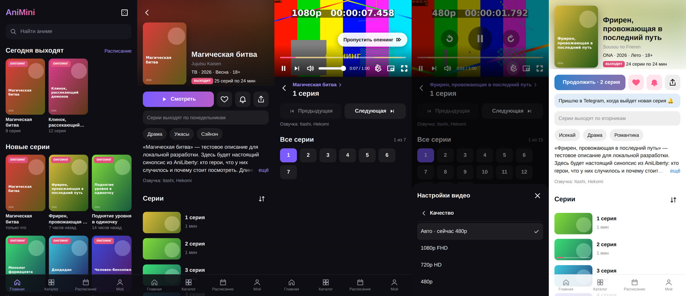

# AniMini — аниме-сайт и Telegram Mini App

Одно веб-приложение, которое работает и как обычный сайт, и как Mini App внутри Telegram. Рядом с ним бот: открывает приложение, ищет тайтлы прямо в чате и присылает уведомления о новых сериях. Видео играет собственный HLS-плеер.



**Что умеет**

- Каталог с поиском и фильтрами (жанры, тип, годы, статус, сортировка), бесконечная прокрутка.
- Страница тайтла: описание, жанры, озвучка, список серий с отметками «просмотрено» и прогрессом.
- Свой плеер:
  - качество «Авто» по скорости сети или фиксированное 480/720/1080;
  - кнопки «Пропустить опенинг» и «Следующая серия» на эндинге, автопропуск опенинга по желанию;
  - автопереход к следующей серии с отсчётом;
  - перемотка двойным тапом по краям экрана;
  - скорость воспроизведения, «картинка в картинке», полный экран (в браузере, на iPhone и в Telegram);
  - горячие клавиши, кнопки на экране блокировки.
- Продолжение просмотра с того же места, история, избранное.
- Расписание онгоингов по дням недели.
- В Telegram: вход без регистрации, синхронизация между устройствами, подписка 🔔 на тайтл, кнопка «Назад», тема Telegram, ссылки `t.me/<бот>/<app>?startapp=…` сразу на тайтл или серию.
- В обычном браузере всё то же самое, только прогресс и избранное хранятся в `localStorage`.

## Как это устроено

```
 Зритель ──► Telegram (Mini App) ─┐
         └─► браузер (сайт) ──────┤  HTTPS
                                  ▼
                    ┌──────────── Caddy ────────────┐
                    │      Node.js (один процесс)    │
                    │  Fastify: /api + фронтенд      │──► AniLiberty API (каталог, серии, расписание)
                    │  grammY-бот (long polling)     │──► Telegram Bot API (меню, уведомления)
                    │  проверка новых серий (cron)   │
                    │  SQLite: пользователи, прогресс│
                    └────────────────────────────────┘
 Видео (HLS) браузер берёт прямо с CDN AniLiberty, либо через /api/hls при HLS_PROXY=1.
```

- **Фронтенд** (`web/`): React + Vite, свой маленький роутер, плеер на [hls.js](https://github.com/video-dev/hls.js). Цвета берутся из темы Telegram (`--tg-theme-*`).
- **Сервер** (`server/`): Fastify. Ходит в AniLiberty, кэширует ответы, приводит их к своему формату (`shared/types.ts`). Хранит данные пользователей в SQLite (встроен в Node 22). Node исполняет TypeScript напрямую, отдельная сборка сервера не нужна.
- **Бот** (`server/bot.ts`): grammY. Работает через long polling, вебхук не нужен.
- **Вход из Telegram**: Mini App передаёт `initData`, подписанную токеном бота. Сервер проверяет подпись HMAC (`server/auth.ts`), поэтому подделать пользователя нельзя.

### Как устроено видео, качества и озвучки

1. AniLiberty отдаёт для каждой серии три HLS-плейлиста: `hls_480`, `hls_720`, `hls_1080`. Видео нарезано на сегменты по несколько секунд, плейлист `.m3u8` перечисляет их по порядку.
2. Сервер собирает из трёх плейлистов **мастер-плейлист** (`/api/master/<серия>.m3u8`). Получив его, hls.js сам переключает качество по скорости сети — это режим «Авто». Пользователь может зафиксировать нужное качество.
3. На iPhone и в Safari HLS играет нативно, на остальных устройствах — через hls.js и Media Source Extensions.
4. Тайминги опенинга и эндинга приходят из API. По ним работают кнопки пропуска и метки на полосе перемотки.
5. Озвучка в AniLiberty одна — их собственная. Другие озвучки (AniDub, Studio Band и т.д.) живут у видеобалансеров вроде Kodik — см. ниже.

### Плееры и озвучки

Над видео — переключатель плеера, как на аниме-сайтах: **AniLibria** (наш HLS-плеер) и встроенный плеер **Kodik**.

- **Kodik без токена.** AniLiberty сам отдаёт для тайтла ссылку на плеер Kodik (`external_player`). Встраиваем её, и озвучку выбирают в меню самого плеера.
- **Kodik с токеном** (`KODIK_TOKEN`, выдают по запросу на support@kodik.biz). Сервер находит тайтл в API Kodik (`POST https://kodik-api.com/search`: сначала по ссылке плеера, затем по `shikimori_id`). У каждой озвучки своя кнопка и число вышедших серий. Выбранная студия запоминается и подставляется в другие тайтлы.
- В общем списке серий есть и те, что вышли в других озвучках, но ещё не у AniLibria. Тайтл, которого у AniLibria нет вовсе, тоже можно смотреть.
- Ссылка `external_player` из AniLiberty встраивается, только если она ведёт на домен Kodik.
- Прогресс в плеере Kodik сохраняется по его событиям `postMessage` (`kodik_player_time_update`, `kodik_player_current_episode`, `kodik_player_video_ended`). Если серию переключили внутри плеера, адрес страницы подстраивается без перезагрузки.

## Быстрый старт (локально, без интернета до AniLiberty)

Нужен Node.js 22.18+ и ffmpeg — им собираются тестовые видео.

```bash
cd anime
npm install
./dev/make-media.sh                 # тестовая «серия» в HLS 480/720/1080 (CODEC=vp9 — для headless Chromium)
npm run dev:mock                    # мок AniLiberty на http://localhost:4010
```

Во втором терминале:

```bash
ANILIBERTY_API=http://localhost:4010/api/v1 ANILIBERTY_MEDIA=http://localhost:4010 npm run dev   # API на :3000
npm run dev:web                     # фронтенд с горячей перезагрузкой на http://localhost:5173
```

С настоящим AniLiberty переменные `ANILIBERTY_*` не нужны: по умолчанию сервер ходит на `https://aniliberty.top/api/v1`.

Сборка как в продакшене: `npm run build && npm start` — сервер сам раздаёт `web/dist` на :3000.

## Бот и Mini App

1. В [@BotFather](https://t.me/BotFather) отправьте `/newbot`, задайте имя и username. Токен положите в `BOT_TOKEN`.
2. Разверните приложение на домене с HTTPS (см. ниже) и укажите `SITE_URL=https://ваш-домен`.
3. Запустите сервер. Он сам поставит боту кнопку меню «Смотреть», которая открывает Mini App, и команды `/start`, `/help`.
4. Для ссылок, которыми делятся из приложения: в BotFather отправьте `/newapp`, выберите бота, укажите URL = `SITE_URL` и короткое имя (например, `watch`). Его же укажите в `BOT_APP_SHORT_NAME`. После этого кнопка «Поделиться» даёт ссылки вида `t.me/<бот>/watch?startapp=r_123`.
5. Чтобы приложение открывалось кнопкой в профиле бота: BotFather → Bot Settings → Configure Mini App → включите Main Mini App с тем же URL.

Без `BOT_TOKEN` приложение работает как обычный сайт: прогресс хранится в браузере, уведомлений нет.

## Установка на VPS одной командой

Нужен VPS на Ubuntu или Debian (от 1 ГБ памяти) и токен бота от [@BotFather](https://t.me/BotFather) (`/newbot`). Домен не обязателен: без него установщик предложит бесплатный адрес вида `203-0-113-10.sslip.io`, который сам указывает на ваш сервер.

```bash
curl -fsSL https://raw.githubusercontent.com/zfd430792-coder/Tg/anime-mini-app/anime/install.sh | sudo bash
```

Установщик:
1. Ставит Docker (если его нет), а на VPS с маленькой памятью добавляет подкачку.
2. Спрашивает токен бота и проверяет его в Telegram, затем домен (проверяет, что он смотрит на этот сервер), название и пару настроек.
3. Скачивает код в `/opt/animini`, пишет `.env` с доступом только для root.
4. Собирает и запускает приложение с HTTPS и ставит боту кнопку меню, которая открывает Mini App.
5. Проверяет порты 80 и 443: они нужны Caddy для HTTPS. Если их уже занимает другой контейнер (например, старый проект) или nginx/apache, показывает, что именно, и предлагает либо остановить это, либо запустить AniMini за вашим прокси на `127.0.0.1:8787` (тогда домен на него направляете сами, пример конфига покажет установщик).
6. Включает **автообновление с GitHub**: каждые 5 минут таймер systemd проверяет ветку `anime-mini-app`. Если есть новый коммит, он пересобирает приложение и проверяет, что оно отвечает. Если новая версия не поднялась, откатывает на прошлую рабочую и больше не пробует этот коммит, пока не выйдет следующий.

Без вопросов, например для автоматизации:

```bash
curl -fsSL https://raw.githubusercontent.com/zfd430792-coder/Tg/anime-mini-app/anime/install.sh \
  | sudo BOT_TOKEN=123456:AA... DOMAIN=anime.example.com AUTO_UPDATE=1 PORTS_BUSY=stop bash
```

`PORTS_BUSY=stop` — остановить то, что занимает 80/443, `PORTS_BUSY=proxy` — встать за ваш прокси.

Управление на сервере:

| Команда | Что делает |
|---|---|
| `sudo animini status` | Версия, статус контейнеров, когда следующая проверка обновлений |
| `sudo animini doctor` | Найти, почему не открывается сайт или Mini App: контейнеры, DNS, HTTPS и сертификат, HTTP/3, кнопка бота, доступность снаружи (в том числе из России) |
| `sudo animini logs` | Логи приложения (`animini logs caddy` — логи HTTPS) |
| `sudo animini update` | Обновить с GitHub прямо сейчас |
| `sudo animini config` | Поменять токен, домен, название. Сменить ветку: `sudo ANIMINI_BRANCH=main animini config` |
| `sudo animini backup` | Сохранить базу пользователей в файл |
| `sudo animini uninstall` | Удалить всё с сервера |

История автообновлений: `journalctl -u animini-update`.

## Деплой вручную

Нужен сервер с Docker и домен, A-запись которого указывает на сервер.

```bash
git clone <репозиторий> && cd <репозиторий>/anime
cp .env.example .env   # заполните DOMAIN, SITE_URL, BOT_TOKEN
docker compose up -d --build
```

Caddy сам выпустит сертификат Let's Encrypt. База SQLite лежит в томе `data`. Для бэкапа достаточно копировать файл `animini.db`, например `docker compose cp app:/data/animini.db ./backup.db`.

### Переменные окружения

| Переменная | Что делает |
|---|---|
| `SITE_URL` | Публичный HTTPS-адрес. Его открывает Mini App, он же идёт в кнопки бота |
| `DOMAIN` | Домен для Caddy (обычно тот же, что в `SITE_URL`) |
| `BOT_TOKEN` | Токен бота. Включает вход через Telegram, подписки и уведомления |
| `BOT_APP_SHORT_NAME` | Короткое имя Mini App из `/newapp`, для ссылок `startapp` |
| `APP_NAME` | Название в шапке и сообщениях бота |
| `ANILIBERTY_API`, `ANILIBERTY_MEDIA` | Адрес API и картинок AniLiberty (если сменится домен) |
| `KODIK_TOKEN` | Токен Kodik: у каждой озвучки своя кнопка. Без него — общий плеер Kodik с выбором внутри |
| `HLS_PROXY` | `1` — видео идёт через ваш сервер. Нужно, если CDN не отдаёт CORS или недоступен у зрителей. **Весь видеотрафик пойдёт через VPS** |
| `NOTIFY_INTERVAL_MIN` | Как часто проверять новые серии (по умолчанию 10 минут) |
| `PORT`, `DB_PATH`, `LOG_LEVEL` | Порт, путь к базе, уровень логов |

## API сервера

| Метод | Что отдаёт |
|---|---|
| `GET /api/latest?limit=24` | Последние обновления |
| `GET /api/catalog?q=&genres=1,2&types=TV&from=2020&to=2024&status=ongoing&sort=RATING_DESC&page=1` | Каталог с фильтрами |
| `GET /api/search?q=` | Быстрый поиск |
| `GET /api/releases/:idOrAlias` | Тайтл с сериями, ссылками на HLS и таймингами OP/ED |
| `GET /api/releases/:idOrAlias/players` | Плееры тайтла: AniLibria и Kodik с озвучками |
| `GET /api/schedule` | Расписание по дням |
| `GET /api/references` | Жанры, типы, годы, сортировки |
| `GET /api/random` | Случайный тайтл |
| `GET /api/master/:episodeId.m3u8` | Мастер-плейлист серии |
| `GET /api/hls?u=` | Прокси HLS (только при `HLS_PROXY=1` и только на хосты из API) |
| `GET/PATCH /api/me` | Профиль, вкл/выкл уведомлений |
| `GET /api/me/releases/:id` | Избранное, подписка и прогресс по тайтлу |
| `GET/PUT/DELETE /api/me/favorites/:id` | Избранное |
| `GET/PUT/DELETE /api/me/subscriptions/:id` | Подписки на новые серии |
| `POST /api/me/progress`, `GET /api/me/history` | Прогресс и «Продолжить просмотр» |

Запросы `/api/me/*` требуют заголовок `Authorization: tma <initData>`.

## Структура

```
anime/
├── server/          сервер: http.ts (API), anilibria.ts (клиент источника), bot.ts, notifier.ts, db.ts, auth.ts
├── web/src/         фронтенд: pages/, components/player.tsx, router.ts, telegram.ts, user.ts
├── shared/          типы и ссылки, общие для сервера и фронтенда
├── dev/             мок AniLiberty и генератор тестового видео
├── install.sh       установка на VPS одной командой
├── deploy/          update.sh (автообновление с GitHub) и animini (команды управления)
├── Dockerfile, docker-compose.yml, Caddyfile
```

## Проверки

```bash
npm run typecheck    # TypeScript: сервер и фронтенд
npm test             # 35 тестов: подпись initData, прокси HLS, уведомления, HTTP API на моке, бот без сети
```

## Что дальше

- **Рейтинги и связи** из Shikimori или AniList (ID у Shikimori совпадают с MyAnimeList).
- Комментарии к сериям, оценки, списки «Смотрю / Брошено / Буду смотреть».
- Монетизация через Telegram Stars: подписка без рекламы, ранний доступ.
- Webhook вместо long polling, если ботов станет несколько.

## Важно про права

Видео и озвучка принадлежат правообладателям и AniLiberty. Проект показывает то, что отдаёт публичный API AniLiberty, и ничего не хранит у себя. Если подключаете другие источники, проверьте, есть ли у них права на контент. Сайты и боты с нелицензионным аниме блокируют (РКН, жалобы правообладателей в Telegram), а владельцев крупных пиратских сайтов преследуют по закону.
